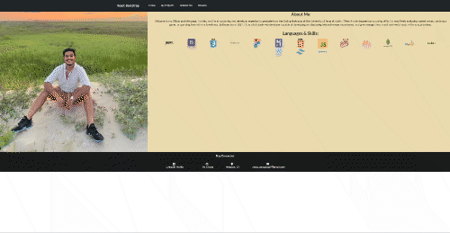

# Alex Gonzalez Portfolio

## License:

## Table of Contents
1. [Description](#description)

2. [Installation](#installation)

3. [Usage](#usage)

4. [Testing](#testing)

5. [Contribution](#contribution)

6. [Questions](#questions)

## Description 
This project was created to showcase my projects and skills.

The development code for this site can be found in this repo: https://github.com/AlexisGonzalez07/AlexGonzalezPortfolio

## Installation 
This app requires no installation.

## Usage 
Live Website: https://alex-gonzalez-portfolio.netlify.app/

Hire Me?

## Testing 
This application has no tests.

## Contribution 
Currently accepting UI design ideas.

## Questions 
Feel free to email me at: alexis.gonzalez07@gmail.com

Visit my Github profile at: [Alex Gonzalez Github](https://www.github.com/AlexisGonzalez07)
